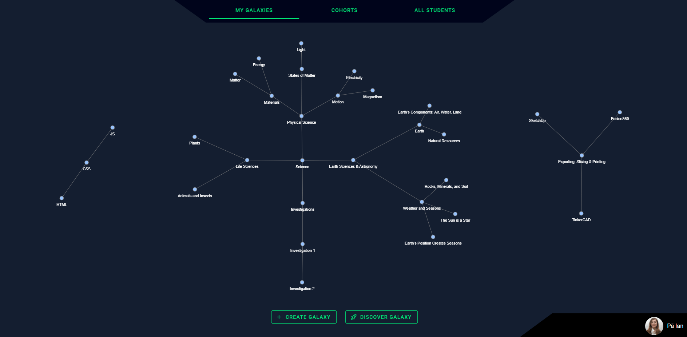
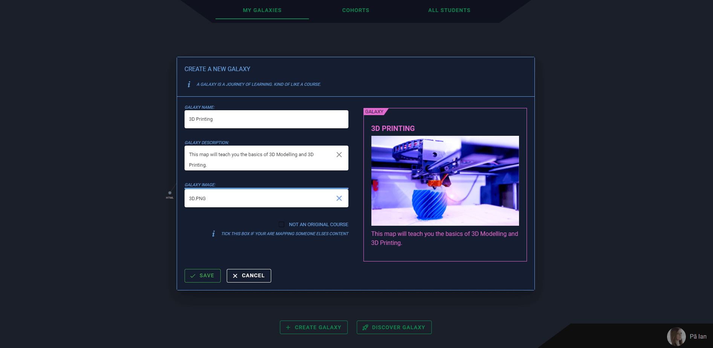
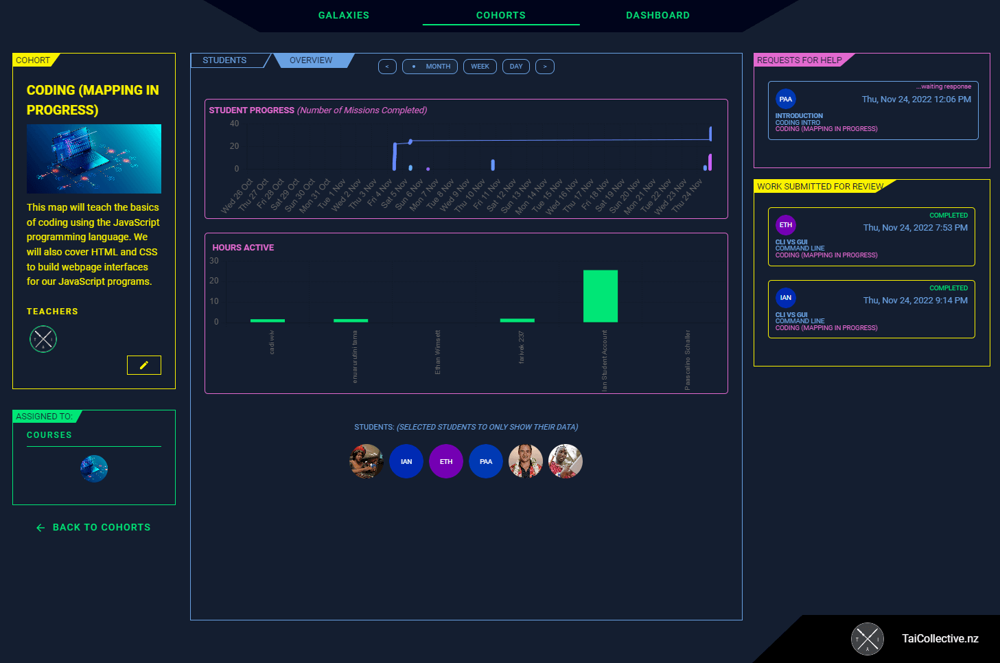
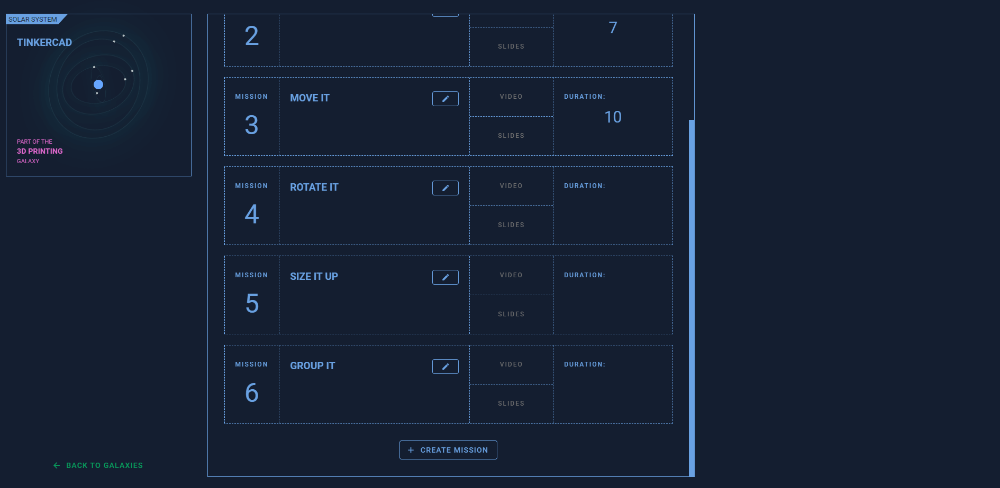

# Galaxy Maps
Galaxy Maps is an online learning platform.

This project enables kaiako (teachers) to map their curriculums into a "Galaxy Map". Taiohi (students) can then navigate the curriculum in an individualised, self-paced, gamified way.

Like their ancestors that used the stars to navigate the seas, using these Galaxy Maps taiohi can navigate their learning.

Read more at: https://tairea.io/2021/09/03/galaxy-maps/

## Screenshots

